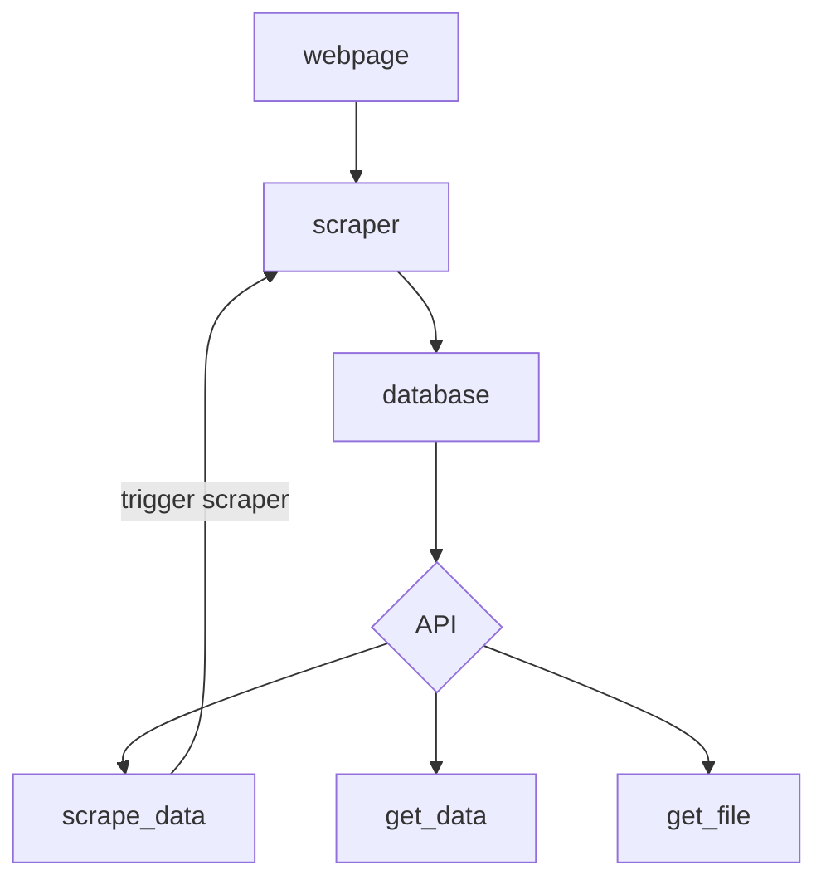

# Real Estate Offers Scraper and Ranking Project

This project is a real estate offers scraper written in Python. It allows you to scrape real estate offers from a specific source and store them in a PostgreSQL database. It also provides an API built with FastAPI, which enables users to fetch the offers and rank them based on certain criteria.




## Installation

1. Clone the repository:

   ```shell
    https://github.com/winiar93/real-estate-price-scraper.git

2. Navigate to the project directory
3. Build and run the Docker containers using Docker Compose:
   ```shell
    docker-compose up -d

This command will build the necessary Docker images and start the containers for the scraper, PostgreSQL database, and FastAPI server.

## Usage

### Fetching Offers using FastAPI
To access the API for fetching and ranking offers, make requests to the FastAPI server running in the Docker container. The server is accessible at http://localhost:8000.


## Endpoints

### scrape_data
To trigger scraper, make a Get request to http://localhost:8000/scrape_data.

### get_data
To fetch all offers, make a GET request to http://localhost:8000/get_data.

### get_file
To get csv file with offers, make a GET request to http://localhost:8000/get_file. As response You will get top 30 offers.
